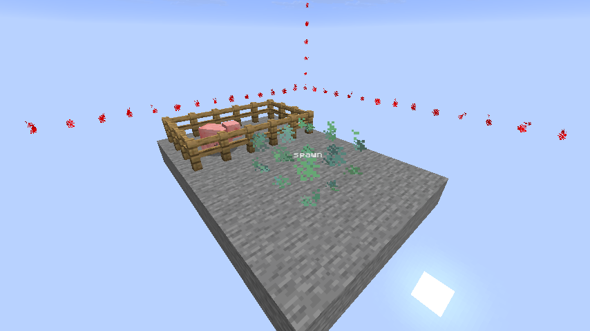
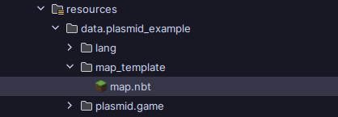
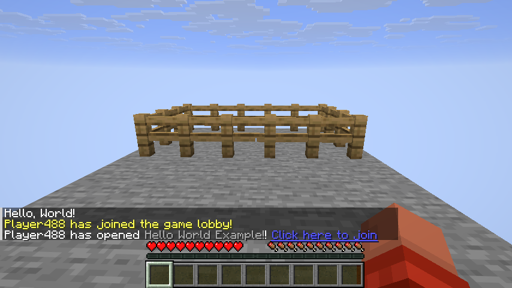
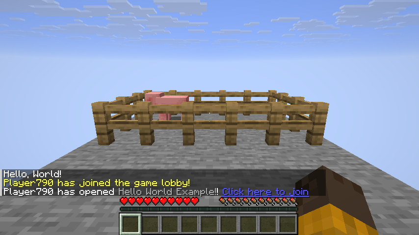

# Adding Map Support
!!! note 
    This page assumes you already have familiarity with [Nucleoid Creator Tools](https://modrinth.com/mod/nucleoid-creator-tools) and the map making process. If not, check out the [Creating Maps](creating-maps.md) page to find out how to make your own maps.

Any minigame requires a map, some can be generated, but most games use maps built by hand. This page will explain the process of adding hand-made map support to your game.

### Creating the Map
To get started, we'll create a new map with a stone platform and add a region named spawn using the Add Region stick. We'll also make a pen for our pig named Jeremy :D
  
We can then export this map, and add it to data/(namespace)/map_template  
  
This folder will store all maps that the game will use, and we'll reference it in our code to load any map given their file name. To do this, we'll have to create some new classes in our example game, though. For now, let's create a new ExampleMap class with a field that stores the map template and the spawn region in our code: 
```java
public class ExampleMap {
    public final MapTemplate template;
    public final TemplateRegion spawn;
    // server needed in future step
    public ExampleMap(MinecraftServer server) {
        /*
         * Map initialization code will be here
         */
    }
}
```
This will initially error, as we never load the map file and thus we don't know where the spawn region is and what value it stores, to fix this, we will have to load the map based on the identifier that we give it (In this example, the namespace would be plasmid_example and the path would be the file name, map). To do this, we will make use of the MapTemplateSerializer.loadFromResource() method, that takes in a Server instance and an Identifier representing our map: 
```java
// Needs to be wrapped in try catch due to possible exception
try {
    this.template = MapTemplateSerializer.loadFromResource(server, Identifier.fromNamespaceAndPath("plasmid_example", "map"));
} catch (IOException exception) {
    throw new GameOpenException(Component.literal("Failed to load map"), exception);
}
```
With the map template in hand, we can finally access all of our regions by accessing the template metadata:
```java
this.spawn = template.getMetadata().getFirstRegion("spawn");
```
### Generating our map
This is all fine and dandy, but we have still yet to generate the map inside our game! This is done using Chunk Generators. If you remember back to our game's open method, we create a TemplateChunkGenerator to generate our level: 
```java
// create a chunk generator that will generate from this template that we just created
TemplateChunkGenerator generator = new TemplateChunkGenerator(context.server(), template);
// set up how the level that this minigame will take place in should be constructed
RuntimeLevelConfig levelConfig = new RuntimeLevelConfig()
        .setGenerator(generator);
```
...nothing's stopping us from using the MapTemplate we acquired from our map to create this chunk generator instead!
```java
ExampleMap map = new ExampleMap(context.server());

// create a chunk generator that will generate from this template that we just created
TemplateChunkGenerator generator = new TemplateChunkGenerator(context.server(), map.template);
```
Lastly, we'll make use of the spawn template region to set where the player should spawn in the Player Accept event. To do this, we'll also need to store the ExampleMap in our game class.
```java
// don't forget to change the constructor to assign this field as well!
private final ExampleMap map;
private JoinAcceptorResult onAcceptPlayers(JoinAcceptor acceptor) {
    return acceptor.teleport(this.level, map.spawn.getBounds().center())
            .thenRunForEach(player -> {
                player.setGameMode(GameType.ADVENTURE);
            });
}
```
And... That's it! 🎉 If we go and join our game now, we get spawned in the right place, with our stone platform and our... ***pig***... pen...

### Operation: Rescue Jeremy
!!! note
    No pigs were harmed in the making of this tutorial  
You might be wondering where Jeremy the pig is. The answer is that he wasn't saved when exporting our map. Thats no good though! How could we fix this? Entities aren't exported by default with Nucleoid Creator Tools, this is both a blessing and a curse, as it can both avoid accidental entities from being exported in your map, but also catch new builders off guard when building their maps. To fix this, we'll need to add a filter for all pigs, Jeremy included, using the following command: `/map entity filter type add minecraft:pig`. If you'd rather add only Jeremy, instead of all pigs, you could instead use `/map entity add (Jeremy UUID)`. When exporting the map, make sure to export with entities, like in this example: `/map export nucleoid_example:map withEntities`, or else entities won't be included with the map.   
Now, if we update our game with the new map file, we should be all good now :D  
  
If you've been following the tutorial so far, you should have ended up with your code looking like this:
**ExampleGame.java**
```java
public class ExampleGame {
    private final ExampleGameConfig config;
    private final GameSpace gameSpace;
    private final ServerLevel level;
    private final ExampleMap map;
    public ExampleGame(ExampleGameConfig config, GameSpace gameSpace, ServerLevel level, ExampleMap map) {
        this.config = config;
        this.gameSpace = gameSpace;
        this.level = level;
        this.map = map;
    }

    public static GameOpenProcedure open(GameOpenContext<ExampleGameConfig> context) {
        // get our config that got loaded by Plasmid
        ExampleGameConfig config = context.config();

        ExampleMap map = new ExampleMap(context.server());

        // create a chunk generator that will generate from this template that we just created
        TemplateChunkGenerator generator = new TemplateChunkGenerator(context.server(), map.template);

        // set up how the level that this minigame will take place in should be constructed
        RuntimeLevelConfig levelConfig = new RuntimeLevelConfig()
                .setGenerator(generator);

        return context.openWithLevel(levelConfig, (activity, level) -> {
            ExampleGame game = new ExampleGame(config, activity.getGameSpace(), level, map);

            activity.deny(GameRuleType.FALL_DAMAGE);
            activity.listen(GamePlayerEvents.ADD, game::onPlayerAdd);
            activity.listen(GamePlayerEvents.OFFER, JoinOffer::accept);

            activity.listen(GamePlayerEvents.ACCEPT, game::onAcceptPlayers);
        });
    }

    private JoinAcceptorResult onAcceptPlayers(JoinAcceptor acceptor) {
        return acceptor.teleport(this.level, map.spawn.getBounds().center())
                .thenRunForEach(player -> {
                    player.setGameMode(GameType.ADVENTURE);
                });
    }

    private void onPlayerAdd(ServerPlayer player) {
        Component message = Component.literal(this.config.greeting());
        this.gameSpace.getPlayers().sendMessage(message);
    }
}
```

**ExampleMap.java**
```java
public class ExampleMap {
    public final MapTemplate template;
    public final TemplateRegion spawn;
    public ExampleMap(MinecraftServer server) {
        // Needs to be wrapped in try catch due to possible exception
        try {
            this.template = MapTemplateSerializer.loadFromResource(server, Identifier.fromNamespaceAndPath("plasmid_example", "map"));
        } catch (IOException exception) {
            throw new GameOpenException(Component.literal("Failed to load map"), exception);
        }
        this.spawn = template.getMetadata().getFirstRegion("spawn");
    }
}
```
That's it! 🎉 <sub>(for real this time)</sub>  
As an extra challenge, try making it so the map identifier that is loaded is determined by the game config, using the Identifier Codec. This is a major step in making your games more data driven, and is very encouraged under the Plasmid framework.